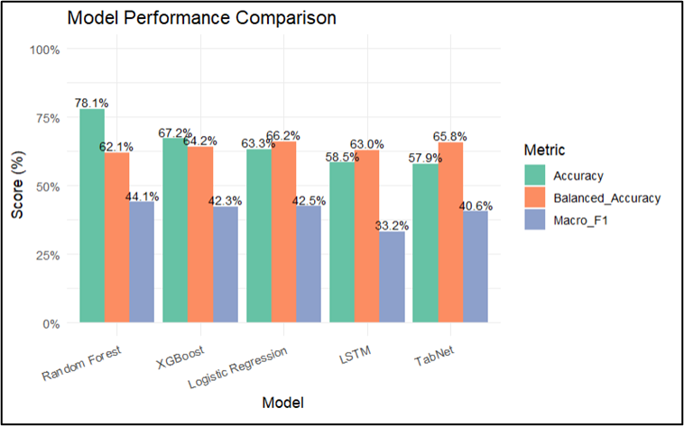
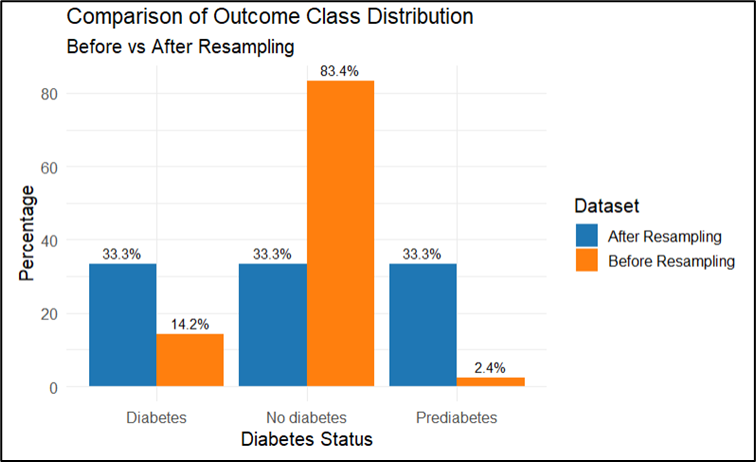
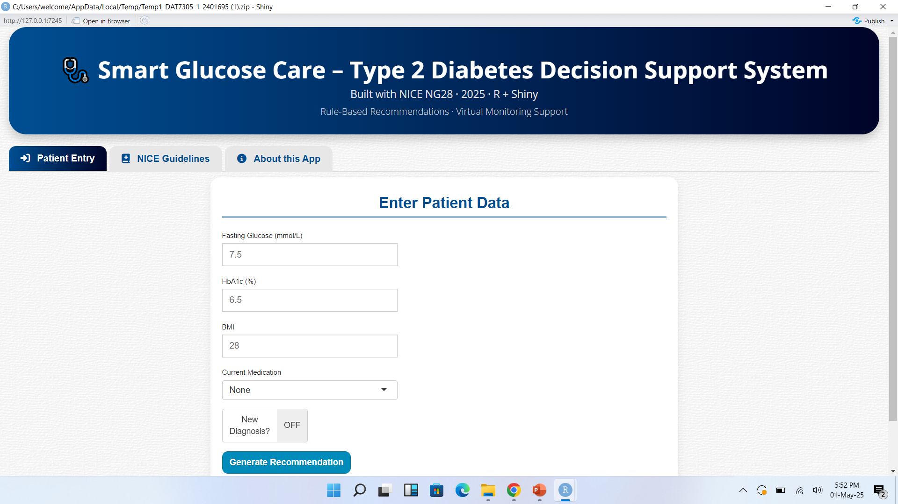
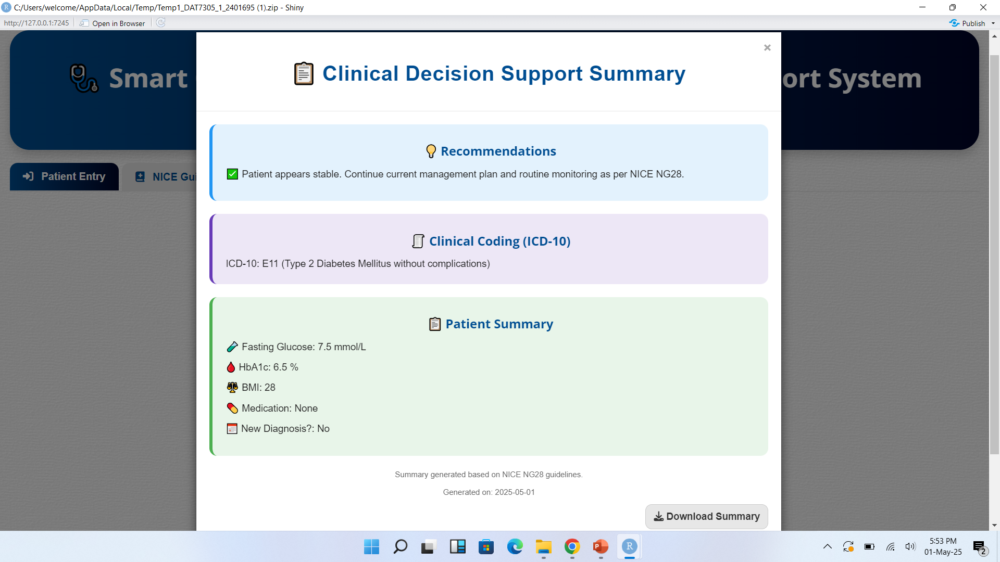
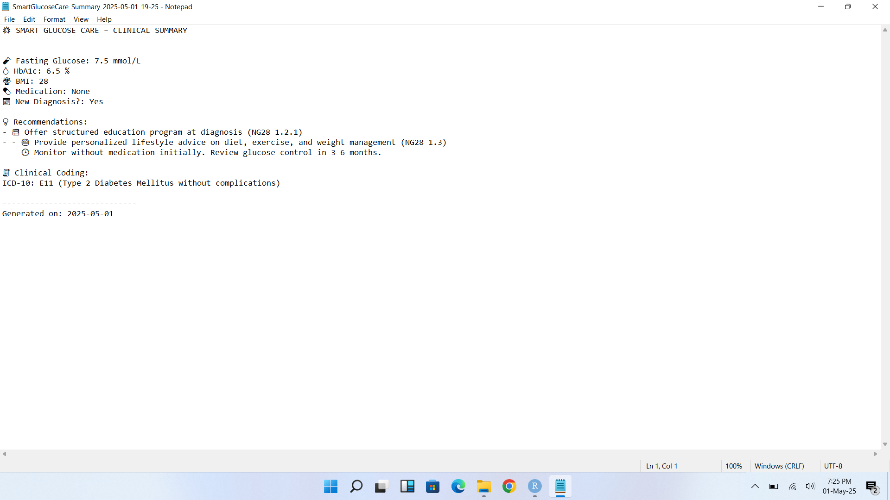
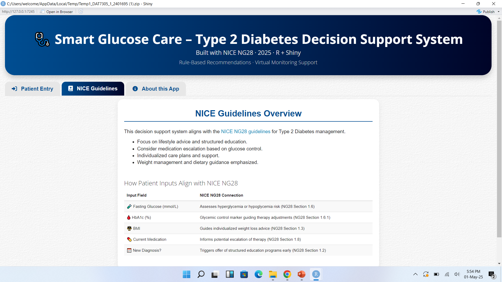
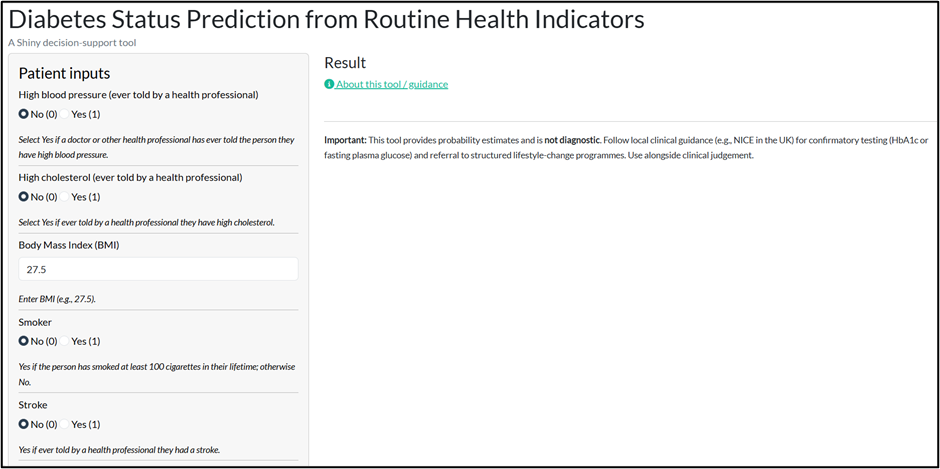
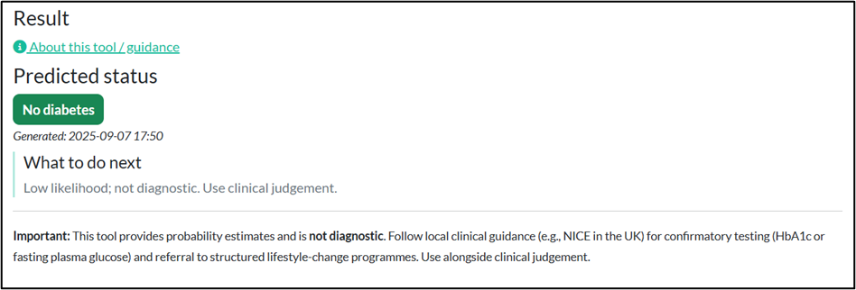
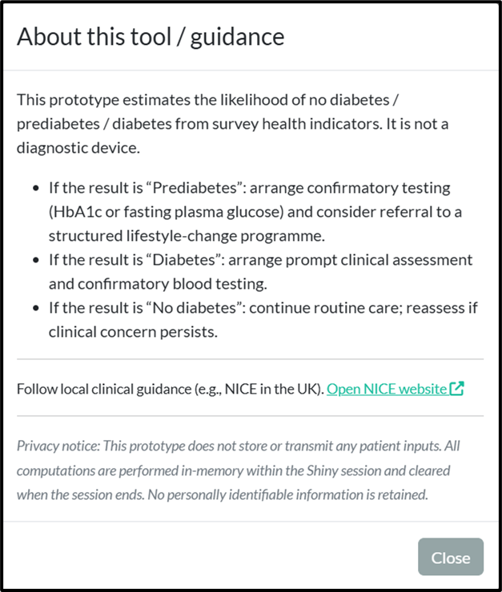
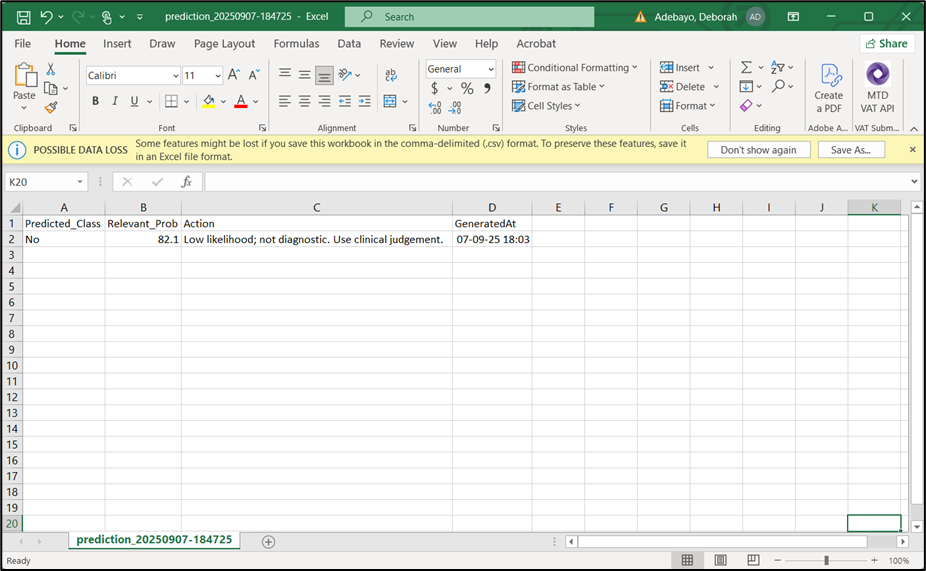

# Visualisations

This folder contains screenshots and figures from both the predictive modelling workflow and the Shiny applications.

## Modelling Visualisations

### Model Performance Comparison
Compares the performance of the implemented models using Accuracy, Balanced Accuracy, and Macro-F1.

### Class Distribution Before and After Resampling
Illustrates how class imbalance was addressed prior to model training.

---

## Dashboard Screenshots

### Clinical Decision Support App – Patient Entry
Main interface used to enter patient clinical information.

### Clinical Decision Support Summary
Displays the generated recommendation, ICD-10 code, and patient summary.

### Downloaded Clinical Summary
Example of the downloadable text summary generated by the app.

### NICE Guidelines Overview
Shows the embedded NICE NG28 guideline reference page within the app.

### Diabetes Prediction App – Main Interface
Shows the patient input panel and prediction interface.

### Diabetes Prediction Result
Displays the predicted diabetes status and recommended next action.

### Guidance Modal
Shows the information and privacy guidance provided to users.

### CSV Export Example
Example of the exported CSV file containing prediction results.

